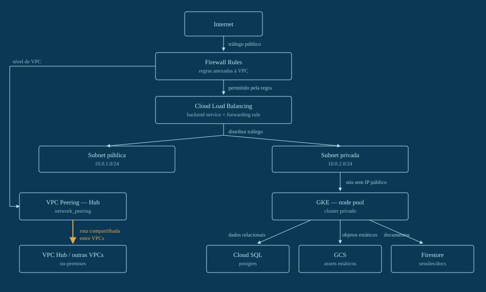

# Arquitetura GCP — Rede, Kubernetes e Dados de Ponta a Ponta

Do isolamento de rede até o banco gerenciado: como VPC, firewall, load balancer, peering, GKE, Cloud SQL, GCS e Firestore se encaixam num único ambiente de produção.

## Terraform

A pasta [`terraform/`](terraform/) contém os 9 arquivos na ordem em que devem ser aplicados:

1. `01-network.tf`
2. `02-subnets.tf`
3. `03-firewall.tf`
4. `04-load-balancer.tf`
5. `05-peering.tf`
6. `06-gke.tf`
7. `07-database.tf`
8. `08-storage.tf`
9. `09-firestore.tf`

## 01. Rede — VPC custom-mode

A VPC começa vazia — nenhuma sub-rede é criada automaticamente, cada faixa de IP é declarada explicitamente.

> Console GCP → VPC network → Create VPC network

**Passos pelo console:**
1. No menu à esquerda, abra `VPC network` → `VPC networks` → `Create VPC network`.
2. Em `Name`, digite `vpc-prod`.
3. Em `Subnet creation mode`, selecione `Custom` — não deixe no modo automático.
4. Em `Maximum transmission unit (MTU)`, mantenha o padrão `1460`.
5. Clique `Create`.

## 02. Subnets — pública e privada

Uma faixa pública para recursos com IP externo e uma privada para o GKE, ambas na mesma região.

> Console GCP → VPC network → vpc-prod → Add subnet

**Passos pelo console:**
1. Ainda na tela da VPC `vpc-prod`, clique `Add subnet`.
2. Preencha `Name: subnet-public`, `Region: southamerica-east1`, `IP address range: 10.0.1.0/24`.
3. Deixe `Private Google Access` em `Off` nessa (é a subnet pública) e clique `Add subnet`.
4. Clique `Add subnet` de novo: `Name: subnet-private`, `Region: southamerica-east1`, `IP range: 10.0.2.0/24`.
5. Nessa segunda, ligue `Private Google Access` para `On`.
6. Clique `Done` e depois `Create`.

## 03. Firewall — regras no nível da VPC

No GCP a regra não pertence à sub-rede: ela é anexada direto à VPC e filtra por tag de destino e range de origem.

> Console GCP → VPC network → Firewall → Create firewall rule

**Passos pelo console:**
1. Abra `VPC network` → `Firewall` → `Create firewall rule`.
2. `Name: allow-lb-health-check`, `Network: vpc-prod`, `Direction: Ingress`, `Action: Allow`.
3. `Target tags: gke-node`.
4. `Source IP ranges: 130.211.0.0/22, 35.191.0.0/16` (faixas dos health checks do Google).
5. Em `Protocols and ports`, marque `tcp`, porta `8080`, e clique `Create`.
6. Repita o fluxo para `allow-iap-ssh`: `Source: 35.235.240.0/20`, porta `22` (acesso via Identity-Aware Proxy).

## 04. Load Balancer — Cloud Load Balancing

Health check, backend service e forwarding rule compõem o balanceador na frente do cluster.

> Console GCP → Network Services → Load balancing → Create load balancer

**Passos pelo console:**
1. Abra `Network Services` → `Load balancing` → `Create load balancer`.
2. Escolha `Application Load Balancer (HTTP/HTTPS)` → `From internet to my VMs or serverless services` → `Configure`.
3. Em `Backend configuration`, crie um backend service apontando para o instance group do GKE, com um `Health check` novo usando o caminho `/health` na porta `8080`.
4. Em `Frontend configuration`, defina `Protocol: HTTP`, `Port: 80`, e reserve um IP externo novo.
5. Revise em `Review and finalize` e clique `Create`.

## 05. VPC Peering-Hub

Uma VPC hub central e peering bidirecional conectam a VPC de produção a outras VPCs e, de lá, à conectividade on-premises.

> Console GCP → VPC network → VPC network peering → Create peering connection

**Passos pelo console:**
1. Crie antes uma segunda VPC chamada `vpc-hub` (mesmo fluxo do passo 01).
2. Abra `VPC network` → `VPC network peering` → `Create peering connection`.
3. `Name: prod-to-hub`, `Your VPC network: vpc-prod`, `Peered VPC network: In this project` → `vpc-hub`. Clique `Create`.
4. Repita do lado do hub: `Name: hub-to-prod`, `Your VPC network: vpc-hub`, `Peered VPC network: vpc-prod`.
5. O peering só aparece como `Active` depois que os dois lados existem.

## 06. Kubernetes gerenciado — GKE

Cluster privado, sem control plane exposto publicamente, com um node pool dedicado dentro da sub-rede privada.

> Console GCP → Kubernetes Engine → Clusters → Create

**Passos pelo console:**
1. Abra `Kubernetes Engine` → `Clusters` → `Create` → escolha `GKE Standard`.
2. `Name: gke-prod`, `Region: southamerica-east1`.
3. Em `Networking`: `Network: vpc-prod`, `Node subnet: subnet-private`.
4. Marque `Private cluster` — deixe o endpoint do control plane restrito ou totalmente privado, conforme sua necessidade de acesso.
5. Em `Node pools` → `default-pool`: `Number of nodes: 3`, `Machine type: e2-standard-4`.
6. Clique `Create` e aguarde o provisionamento (alguns minutos).

## 07. Banco relacional — Cloud SQL

Postgres gerenciado, com IP privado apontando só para dentro da VPC — sem exposição pública.

> Console GCP → SQL → Create instance → PostgreSQL

**Passos pelo console:**
1. Abra `SQL` → `Create instance` → escolha `PostgreSQL`.
2. `Instance ID: prod-postgres` e defina uma senha forte para o usuário `postgres`.
3. `Database version: PostgreSQL 15`, `Region: southamerica-east1`.
4. Em `Connections`, desligue `Public IP` e ligue `Private IP`, associando à `vpc-prod`.
5. Em `Machine configuration`, escolha um perfil equivalente a 4 vCPUs / 16 GB.
6. Clique `Create Instance` e, depois de criada, vá em `Databases` → `Create database` → nome `app`.

## 08. Object Storage — GCS

Bucket regional para artefatos e assets estáticos, com versionamento habilitado.

> Console GCP → Cloud Storage → Buckets → Create

**Passos pelo console:**
1. Abra `Cloud Storage` → `Buckets` → `Create`.
2. `Name: prod-app-assets` (precisa ser um nome globalmente único).
3. `Location type: Region`, `Location: southamerica-east1`.
4. `Storage class: Standard`.
5. Em `Protection tools`, ative `Object versioning`.
6. Clique `Create`.

## 09. NoSQL — Firestore

Firestore em modo nativo cobre sessões e documentos que não precisam de schema relacional.

> Console GCP → Firestore → Create database

**Passos pelo console:**
1. Abra `Firestore` → `Create database`.
2. Escolha `Native mode` (não `Datastore mode`).
3. `Location: southamerica-east1`, para ficar na mesma região do resto do ambiente.
4. Clique `Create Database`.

## Aviso

O console do Google Cloud muda de layout e nomenclatura com alguma frequência. Se um item não estiver exatamente onde este guia descreve, a sequência lógica (rede → firewall → load balancer → peering → GKE → dados) continua valendo — procure pelo nome do serviço na busca do console.
